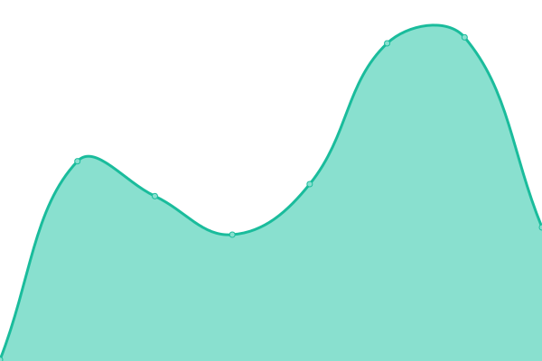
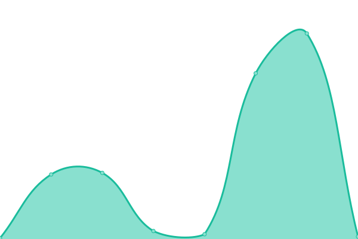
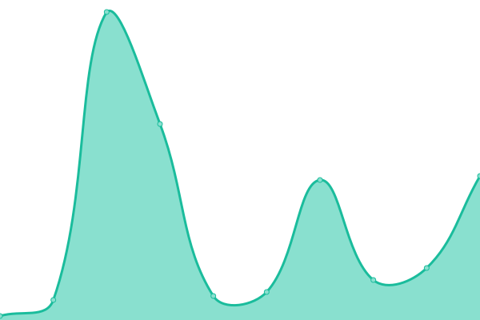

# [📈 Live Status](https://wiktorwojcik112.github.io/WWUpptime): <!--live status--> **🟩 All systems operational**

This repository contains the open-source uptime monitor and status page for [Wiktor Wójcik](wiktor.thedev.id), powered by [Upptime](https://github.com/upptime/upptime).

With [Upptime](https://upptime.js.org), you can get your own unlimited and free uptime monitor and status page, powered entirely by a GitHub repository. We use [Issues](https://github.com/wiktorwojcik112/WWUpptime/issues) as incident reports, [Actions](https://github.com/wiktorwojcik112/WWUpptime/actions) as uptime monitors, and [Pages](https://wiktorwojcik112.github.io/WWUpptime) for the status page.

<!--start: status pages-->
<!-- This summary is generated by Upptime (https://github.com/upptime/upptime) -->
<!-- Do not edit this manually, your changes will be overwritten -->
<!-- prettier-ignore -->
| URL | Status | History | Response Time | Uptime |
| --- | ------ | ------- | ------------- | ------ |
|  [Apps site](https://wiktor.thedev.id) | 🟩 Up | [apps-site.yml](https://github.com/wiktorwojcik112/WWUpptime/commits/HEAD/history/apps-site.yml) | 

 123ms
     
 | 

<a href="https://wiktorwojcik112.github.io/WWUpptime/history/apps-site">100.00%</a>
    

|  [Harmony update](https://wiktor.thedev.id/HarmonyVersion.txt) | 🟩 Up | [harmony-update.yml](https://github.com/wiktorwojcik112/WWUpptime/commits/HEAD/history/harmony-update.yml) | 

 30ms
     
 | 

<a href="https://wiktorwojcik112.github.io/WWUpptime/history/harmony-update">100.00%</a>
    

|  [Clock update](https://wiktor.thedev.id/ClockVersion.txt) | 🟩 Up | [clock-update.yml](https://github.com/wiktorwojcik112/WWUpptime/commits/HEAD/history/clock-update.yml) | 

 41ms
     
 | 

<a href="https://wiktorwojcik112.github.io/WWUpptime/history/clock-update">100.00%</a>
    

<!--end: status pages-->

[**Visit our status website →**](https://wiktorwojcik112.github.io/WWUpptime)

## 📄 License

- Powered by: [Upptime](https://github.com/upptime/upptime)
- Code: [MIT](./LICENSE) © [Wiktor Wójcik](wiktor.thedev.id)
- Data in the `./history` directory: [Open Database License](https://opendatacommons.org/licenses/odbl/1-0/)
